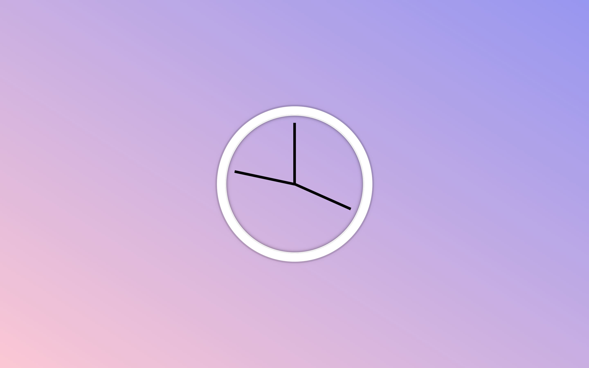

# Project 02 JS & CSS Clock

Participating in the [JavaScript30 challenge by WesBos](https://javascript30.com/).

### Screenshot

### Links

- Live Site URL: [Live site of the challenge hosted here](https://junayedrahaman50.github.io/JavaScript30/02-JS-CSS-Clock/)

### What I learned:

- Using transform-origin property.
- Using transition-timing-function property.
- Implementing clock in javascript using Date() constructor.
