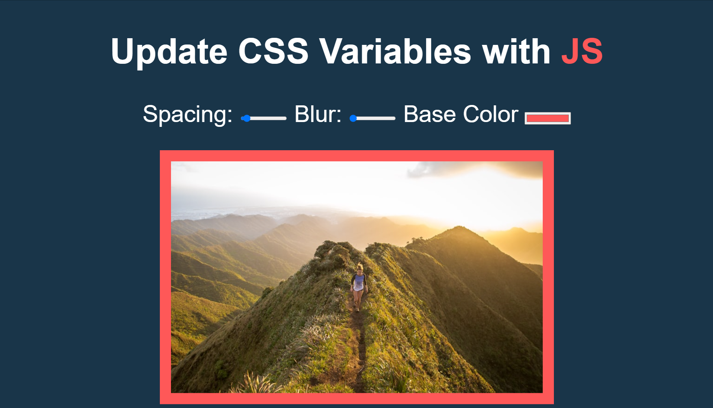

# Project 03 CSS Variables

Participating in the [JavaScript30 challenge by WesBos](https://javascript30.com/).

### Screenshot

### Links

- Live Site URL: [Live site of the challenge hosted here](https://junayedrahaman50.github.io/JavaScript30/03-CSS-Variables/)

### What I learned:

- Declaring and using css variables.
- Difference between NodeList and Array.
- Using [dataset](https://developer.mozilla.org/en-US/docs/Web/API/HTMLElement/dataset) property.
- Using [documentElement](https://developer.mozilla.org/en-US/docs/Web/API/Document/documentElement) property.
- Using [setProperty()](https://developer.mozilla.org/en-US/docs/Web/API/CSSStyleDeclaration/setProperty) method.
- Scoping css variables to a specific element.
- Manipulating css variables using JS.
