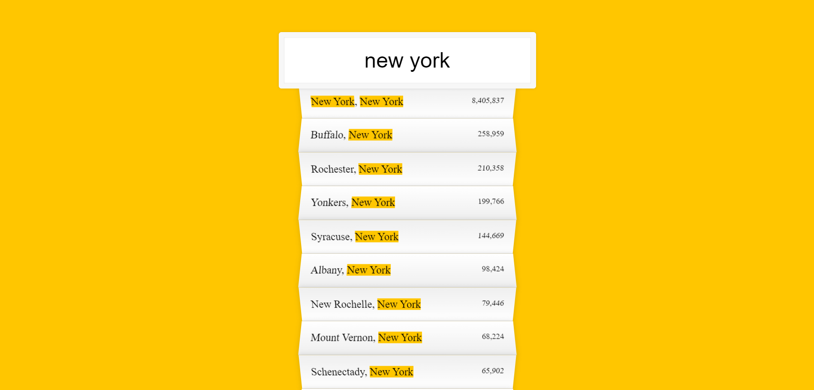

# Project 06 Type Ahead

Participating in the [JavaScript30 challenge by WesBos](https://javascript30.com/).

## Screenshot

## Links

- Live Site URL: [Live site of the challenge hosted here](https://junayedrahaman50.github.io/JavaScript30/06-Type-Ahead/)

## What I learned:

- Had some more practice on using [Fetch API](https://developer.mozilla.org/en-US/docs/Web/API/Fetch_API).
- JavaScript [RegExp() constructor](https://developer.mozilla.org/en-US/docs/Web/JavaScript/Reference/Global_Objects/RegExp/RegExp).
- Javascript [String.prototype.replace()](https://developer.mozilla.org/en-US/docs/Web/JavaScript/Reference/Global_Objects/String/replace) method.
- Javascript [Array.prototype.join()](https://developer.mozilla.org/en-US/docs/Web/JavaScript/Reference/Global_Objects/Array/join) method.
